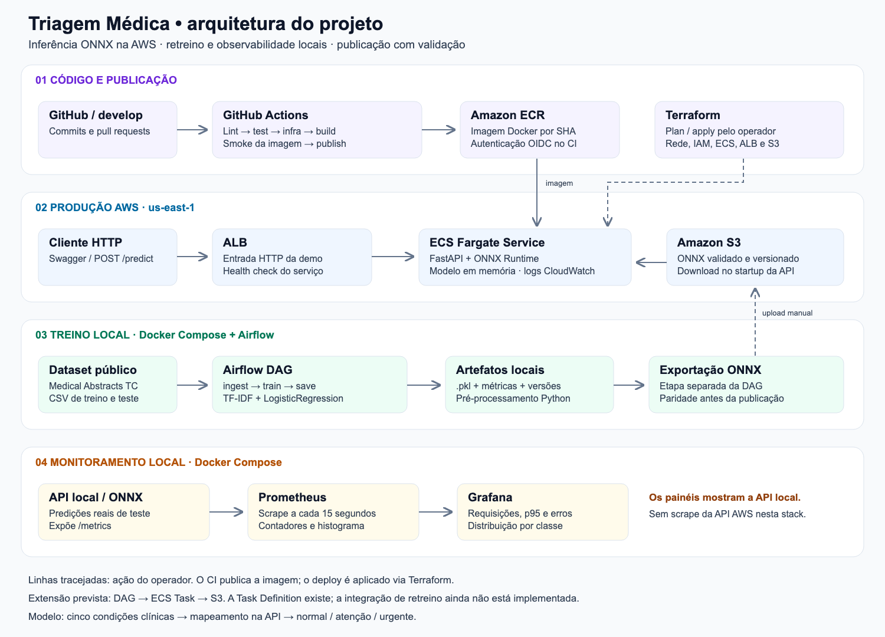
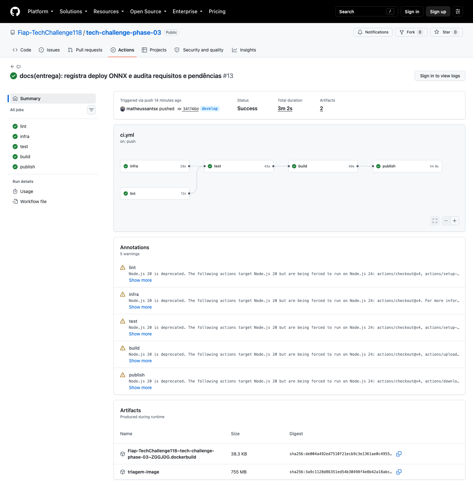
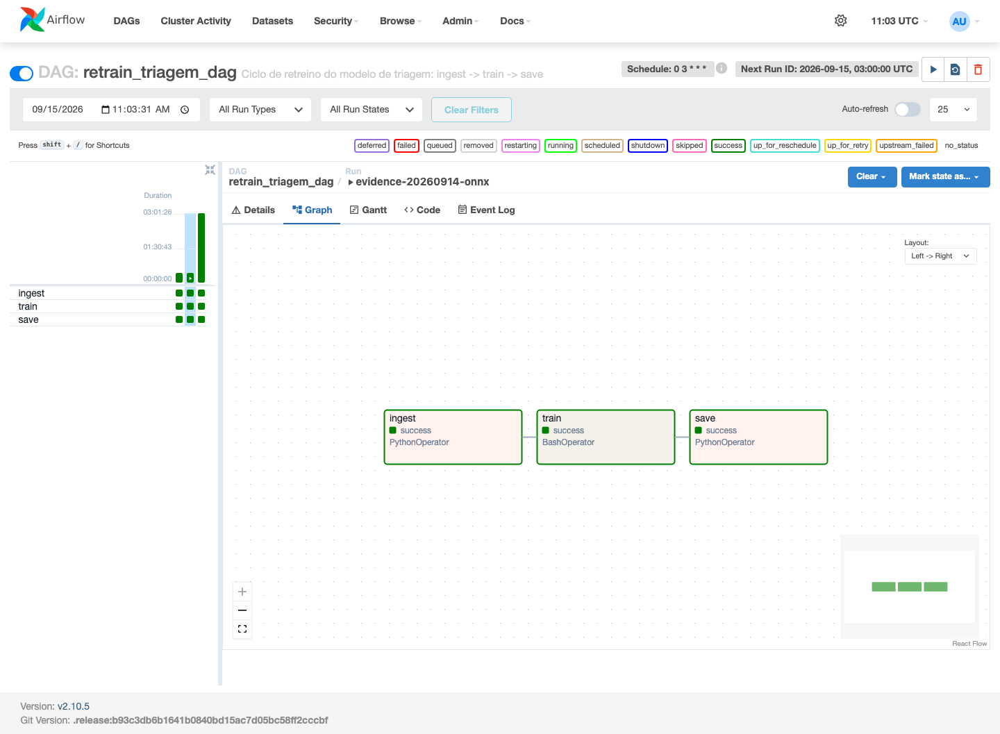

# Triagem Médica

**Classificação de textos médicos com ONNX, API em produção na AWS e pipeline de MLOps.**

Tech Challenge · Fase 3 · FIAP

[](https://youtu.be/JenHbyULiw8?si=Y__uU2oqJ8fXVZff)
[](http://tc03-triagem-1006816505.us-east-1.elb.amazonaws.com/docs)

| Acesse o projeto | Link direto |
|---|---|
| **🎬 Vídeo STAR — apresentação** | **[Assistir no YouTube](https://youtu.be/JenHbyULiw8?si=Y__uU2oqJ8fXVZff)** |
| **🚀 API em produção — demonstração interativa** | **[Abrir o Swagger e testar a API](http://tc03-triagem-1006816505.us-east-1.elb.amazonaws.com/docs)** |
| Saúde da API | [Consultar `/health`](http://tc03-triagem-1006816505.us-east-1.elb.amazonaws.com/health) |
| Integração contínua | [Acompanhar o GitHub Actions](https://github.com/Fiap-TechChallenge118/tech-challenge-phase-03/actions/workflows/ci.yml) |

> A infraestrutura da demonstração tem janela de operação até **26/09/2026**. O vídeo permanece como registro da apresentação.


[](https://github.com/Fiap-TechChallenge118/tech-challenge-phase-03/actions/workflows/ci.yml)

[Visão geral](#visão-geral) · [Arquitetura](#arquitetura) · [Execução](#como-executar) · [Resultados](#resultados) · [Evidências](#evidências) · [Documentação](#documentação)

## Visão geral

O projeto demonstra o ciclo de um modelo NLP: preparação dos dados, treino, exportação ONNX, publicação de imagem, inferência REST e monitoramento. O foco é colocar o modelo em operação com testes, observabilidade e medição de latência.

A API recebe um texto médico **em inglês**, prediz uma de cinco condições e aplica um mapeamento do projeto para `normal`, `atenção` ou `urgente`. A confiança retornada corresponde à condição predita. Trata-se de uma demonstração acadêmica; as categorias de urgência são derivadas do dataset, não de rótulos de triagem clínica.

| Componente | Implementação |
|---|---|
| Dados | Medical Abstracts TC Corpus: **14.438 textos**, sendo 11.550 de treino e 2.888 de teste |
| Modelo | Pré-processamento Python → TF-IDF → LogisticRegression |
| Inferência | FastAPI + ONNX Runtime, modelo carregado uma vez no startup |
| Automação | GitHub Actions e DAG Airflow local `ingest → train → save` |
| Produção | ECS Fargate + ALB, imagem no ECR e modelo no S3 |
| Observabilidade | Prometheus + Grafana locais; CloudWatch Logs para diagnóstico do ECS |

## Arquitetura



[Ver imagem em tamanho original](docs/arquitetura.png) · [Fonte vetorial](docs/arquitetura.svg)

### Decisão de deploy: real-time para inferência, batch para treino

A API responde de forma síncrona: cada `POST /predict` retorna a classificação com o modelo já em memória. Essa escolha atende à demonstração de triagem com resposta imediata. O treino roda em batch, separado das requisições de inferência.

O **ECS Fargate** mantém o container ativo sem gerenciar servidores; o **ALB** fornece o ponto de entrada e os health checks. O modelo é baixado do **S3** no startup, permitindo publicar outra versão do artefato sem reconstruir a imagem. A troca exige atualizar/reiniciar o serviço para carregar o novo modelo.

O **GitHub Actions** valida e publica a imagem no ECR. O operador aplica o deploy com **Terraform**. A DAG entregue roda localmente e salva `.pkl`, métricas e versões; exportar ONNX e publicar no S3 são passos separados. Existe uma Task Definition de treino no ECS, mas sua integração com a DAG/S3 permanece uma extensão do plano interno.

## Como executar

**Pré-requisitos:** Python 3.11 e Docker com Docker Compose. AWS e Terraform são necessários apenas para operar a infraestrutura de nuvem.

### 1. Preparar ambiente e dados

```bash
git clone --branch develop https://github.com/Fiap-TechChallenge118/tech-challenge-phase-03.git
cd tech-challenge-phase-03
python3.11 -m venv .venv
source .venv/bin/activate
pip install -c constraints.txt -e ".[dev]"
cp .env.example .env
python scripts/download_data.py
```

### 2. Treinar e exportar ONNX

```bash
python -m src.train \
  --data data/raw/medical_tc_train.csv \
  --test-data data/raw/medical_tc_test.csv \
  --model models/model.pkl \
  --classifier logistic --test-size 0.2 --random-state 42

python -m src.export_onnx \
  --model models/model.pkl --output models/model.onnx \
  --data data/raw/medical_tc_test.csv --n 2888
```

A exportação deve terminar com **zero divergências**. Use o modelo treinado com o código atual; o `.pkl` antigo não tem a mesma paridade ONNX. Dados e artefatos são gerados localmente e não ficam no Git.

### 3. Subir a stack e testar

```bash
docker compose up --build -d
curl -fsS http://localhost:8000/health

curl -X POST http://localhost:8000/predict \
  -H 'Content-Type: application/json' \
  -d '{"texto":"Cardiovascular heart chest pain"}'
```

**Confirme `"model":"loaded"` no health.** Se o artefato estiver ausente ou falhar ao carregar, a API usa mock; HTTP 200 sozinho não comprova inferência real.

| Serviço local | Acesso |
|---|---|
| API / Swagger | http://localhost:8000/docs |
| Prometheus | http://localhost:9090 |
| Grafana | http://localhost:3000/d/triagem — `admin` / `admin` no primeiro uso, salvo configuração diferente |
| Airflow | http://localhost:8080 — após iniciar o Compose específico |

<details>
<summary><strong>Execução alternativa: API em Python ou Docker isolado</strong></summary>

Com o ONNX já gerado, escolha uma opção em vez da API do Compose:

```bash
# Python local
uvicorn app.main:app --reload --env-file .env

# Docker isolado
docker build -t triagem-api .
docker run --rm -p 127.0.0.1:8000:8000 \
  -e USE_ONNX=true -e MODEL_PATH=/app/models/model.onnx \
  -v "$PWD/models:/app/models:ro" triagem-api
```

</details>

### Retreino com Airflow

Com os dados baixados, inicie o Airflow e dispare `retrain_triagem_dag` pela interface:

```bash
docker compose -f docker-compose.airflow.yml up --build -d
```

A DAG valida os CSVs, treina o modelo e versiona os artefatos locais. [Login, execução e detalhes de persistência](docs/dag_execucao.md).

### Testes e qualidade

```bash
ruff check app/ src/
pytest -v tests/ scripts/test_benchmark.py scripts/test_validate_model.py
```

**17 testes aprovados** na versão validada: contrato HTTP, validações de entrada, benchmark, artefatos e integração com ONNX real gerado durante o teste. A suíte não exige acesso ao S3.

## Resultados

### Qualidade e paridade

| Medida | Resultado |
|---|---:|
| Acurácia no holdout oficial | **60,84%** |
| Macro-F1 no holdout oficial | **0,6110** |
| Classes idênticas: sklearn × ONNX | **2.888 / 2.888** |
| Maior diferença de probabilidade na revalidação | **2,65 × 10⁻⁷** |
| Tamanho do ONNX publicado | **8,74 MB** |

O modelo prevê cinco condições; a API faz o [mapeamento para urgência](docs/dataset.md). Há textos compartilhados entre treino e teste oficiais e textos com múltiplos rótulos. Os [limites da avaliação](docs/eda_resumo.md) acompanham as [métricas atuais](models/metrics.json).

### Otimização de latência

Comparação controlada, na mesma máquina Windows/WSL2, com 500 chamadas e 20 de aquecimento:

| Medida | sklearn | ONNX | Variação |
|---|---:|---:|---:|
| p50 | 2,340 ms | 1,776 ms | −24,1% |
| p95 | 3,119 ms | 2,353 ms | **−24,6%** |
| p99 | 3,652 ms | 3,535 ms | −3,2% |
| Throughput | 411,8 req/s | 524,6 req/s | **+27,4%** |

[Metodologia e comparação completa](docs/latencia_comparativo.md) · [Baseline inicial](docs/latencia_baseline.md).

Na validação pública via ALB, o ONNX teve **p95 de 197,117 ms**, incluindo a rede até a AWS. Na revalidação local com Airflow na mesma máquina, o p95 foi **5,944 ms**. São condições diferentes do comparativo controlado. [Benchmark AWS](docs/benchmark_aws_onnx.json) · [Benchmark local](docs/benchmark_local_onnx.json).

## Evidências

### GitHub Actions

Fluxo: **lint → testes + validação de infraestrutura → build/smoke → publicação ECR**. Push e PR para `develop` acionam validação; a publicação usa OIDC e ocorre na `develop`. O deploy ECS é aplicado separadamente.



A captura corresponde ao [run 34914969894, commit 341746d](https://github.com/Fiap-TechChallenge118/tech-challenge-phase-03/actions/runs/34914969894). O badge no topo acompanha o estado atual da branch.

### Grafana com inferência ONNX


Quatro painéis: predições, p95 de inferência, erros por segundo e distribuição por classe. O Prometheus coleta a cada 15 segundos.

**O print é um registro do tráfego local de 14/09, 22:08–22:13 (São Paulo).** Os contadores acumulam chamadas desde o início do processo; a curva p95 depende do tráfego na janela selecionada. Por isso, ao abrir o Grafana depois, os valores podem ser diferentes e o p95 pode ficar vazio sem chamadas recentes. Essa stack monitora a API local.

Para alimentar os painéis:

```bash
python scripts/benchmark.py --n 500
```

Aguarde pelo menos dois scrapes. O p95 do painel é estimado pelo histograma de inferência; o benchmark mede HTTP. O contador de erros de inferência não inclui rejeições HTTP 422.

### Airflow e EDA



Run `evidence-20260914-onnx`: três tarefas em **success**, encerrado em 14/09 às 22:09:26 (São Paulo). [Estados das tarefas](docs/airflow_execucao.json).

O [notebook EDA](notebooks/01_eda.ipynb) tem 16 células executadas, outputs salvos e quatro gráficos regenerados. [Registro das capturas e validações](docs/evidencias_atualizadas.md).

## Operação em produção

A API usa `USE_ONNX=true` e `MODEL_KEY=models/releases/d447ec1/model.onnx`. O deploy foi validado com ECS estável, `model=loaded` e predições equivalentes ao sklearn.

- **Configuração:** [.env.example](.env.example) e [exemplo Terraform](infra/terraform.tfvars.example). Para modelo local, deixe `MODEL_BUCKET` vazio e use `MODEL_PATH=models/model.onnx` / `MODEL_FILE=model.onnx`.
- **Deploy e rollback:** [release ONNX](docs/deploy_onnx.md), [guia de operação](docs/dev-b-operacao.md) e [outputs AWS](docs/aws_outputs.json).
- **Encerramento:** até **26/09/2026**, definir `enable_inference=false`, revisar o plan e aplicar. Tags não desligam recursos automaticamente; S3 e ECR permanecem armazenados.

## Documentação

| Conteúdo | Referência |
|---|---|
| Apresentação STAR | **[Assistir ao vídeo](https://youtu.be/JenHbyULiw8?si=Y__uU2oqJ8fXVZff)** |
| Dataset e mapeamento | [docs/dataset.md](docs/dataset.md) |
| Análise exploratória | [docs/eda_resumo.md](docs/eda_resumo.md) |
| Retreino local | [docs/dag_execucao.md](docs/dag_execucao.md) |
| Comparativo de latência | [docs/latencia_comparativo.md](docs/latencia_comparativo.md) |
| Evidências e rastreabilidade | [docs/evidencias_atualizadas.md](docs/evidencias_atualizadas.md) |
| Auditoria dos entregáveis | [docs/status-entrega.md](docs/status-entrega.md) |
| Contribuição | [CONTRIBUTING.md](CONTRIBUTING.md) |

## Time

| Integrante | Responsabilidade |
|---|---|
| Alexandre Araújo | API, testes, documentação e apresentação |
| Matheus Santos | Infraestrutura, CI/CD, observabilidade e AWS |
| Matheus Ferreira | Dataset, EDA, modelo, Airflow e ONNX |
