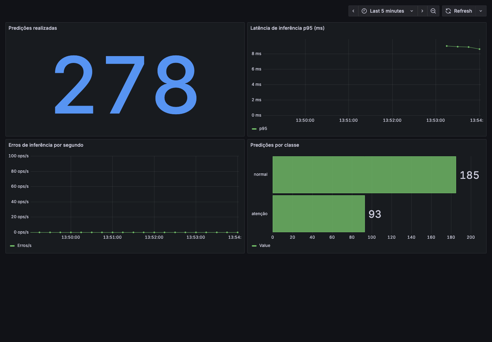

# Triagem Médica — Sistema de Classificação de Urgência

[](https://github.com/Fiap-TechChallenge118/tech-challenge-phase-03/actions/workflows/ci.yml)

> Classificação automática de urgência de laudos médicos (`normal` / `atenção` / `urgente`) via API REST, com pipeline de treino orquestrado, monitoramento e deploy em produção na AWS.

## Visão Geral

<!-- Preencher na ETAPA 11: o que o sistema faz, quem usa, visão de alto nível. -->

## Decisão Arquitetural

### Batch vs Real-Time

A triagem hospitalar é um processo **síncrono e sensível ao tempo**: o resultado precisa ser entregue ao profissional de saúde imediatamente após a submissão do laudo, sem acúmulo em fila. Processar requisições em batch (ex.: Lambda agendado ou job periódico) introduziria latência de minutos a horas, inaceitável para o fluxo clínico.

Por isso, a escolha é **inferência real-time**: cada requisição `POST /predict` recebe resposta em milissegundos, com o modelo já carregado em memória.

### Arquitetura de Deploy (ECS Fargate + ALB)

```
Cliente HTTP
    │
    ▼
Application Load Balancer (ALB)
    │  — balanceamento e health check (HTTP na demo)
    ▼
ECS Fargate Service  (container FastAPI + uvicorn, persistente)
    │  — baixa model.onnx do S3 no startup, serve /predict /health /metrics
    ▼
Amazon S3  (artefatos de modelo: model.onnx / model.pkl)
```

**Por que ECS Fargate Service (e não Lambda ou EC2)?**

| Critério | Lambda | EC2 | ECS Fargate Service ✅ |
|---|---|---|---|
| Cold start com modelo em memória | Alto (recarrega a cada invocação fria) | Baixo | Baixo (container persistente) |
| Escalabilidade horizontal | Automática, mas limitada pelo cold start | Manual | Automática via desired_count |
| Custo de operação contínua | Barato se ocioso | Caro (instância sempre ligada) | Proporcional ao uso |
| Scrape Prometheus (`/metrics`) | Incompatível (sem IP fixo por invocação) | Possível | Nativo (target estável) |
| Sem gerência de servidor | Sim | Não | Sim |

O container **baixa o artefato do S3 no startup** — o modelo não fica embutido na imagem Docker. Isso permite que um retreino (ECS Fargate Task) atualize o `model.onnx` no S3 sem rebuild da imagem.

### Pipeline de Treino (ECS Fargate Task)

O retreino é um processo **batch sob demanda**, orquestrado por uma DAG do Airflow:

```
Airflow DAG  →  ECS Fargate Task  (container efêmero, mesmo CMD override)
                    │  lê dataset de  s3://bucket/data/raw/
                    │  treina pipeline TF-IDF + LogisticRegression
                    ▼
                s3://bucket/models/model.onnx  (atualizado)
```

A mesma imagem Docker serve inferência (ECS Service, `CMD uvicorn`) e treino (ECS Task, `CMD python src/train.py`), reduzindo superfície de manutenção.

### Variáveis de Ambiente

| Variável | Descrição | Exemplo |
|---|---|---|
| `MODEL_BUCKET` | Bucket S3 dos artefatos | `meu-bucket-modelos` |
| `MODEL_KEY` | Chave do artefato no S3 | `models/model.onnx` |
| `USE_ONNX` | `true` = ONNX Runtime / `false` = sklearn | `true` |
| `AWS_REGION` | Região do bucket | `us-east-1` |
| `LOG_LEVEL` | Nível de log da API | `INFO` |

## Modelo

Classificador de texto (NLP) leve que categoriza o laudo médico em **5 condições**
(`neoplasms`, `digestive system diseases`, `nervous system diseases`,
`cardiovascular diseases`, `general pathological conditions`) — decisão de escopo
acordada com o grupo: o modelo prevê as 5 condições nativas e a API converte para
urgência (`normal` / `atenção` / `urgente`).

| Componente | Detalhe |
|------------|---------|
| Dataset | [Medical Abstracts TC Corpus](https://www.kaggle.com/datasets/saharalaa/medical-abstracts-tc-corpus) (Kaggle) |
| Pipeline | `preprocess → TF-IDF → LogisticRegression` (scikit-learn, CPU) |
| Artefato | `models/model.pkl` (pipeline completo, consumível pela API) |

### Resultados (split de teste, 2.310 laudos)

| Classificador | Acurácia | Macro-F1 |
|---------------|---------:|---------:|
| RandomForest (default) | 0.486 | 0.440 |
| LinearSVC (C=0.1, balanced) | 0.595 | 0.594 |
| **LogisticRegression (C=0.3, balanced)** | **0.607** | **0.609** |

Métricas completas (F1 por classe, holdout oficial): `docs/metricas_modelo.txt` e
`models/metrics.json`.

### Treinar

```bash
pip install -e ".[dev]"
python scripts/download_data.py            # baixa o dataset → data/raw/
python src/train.py \
    --data data/raw/medical_tc_train.csv \
    --test-data data/raw/medical_tc_test.csv \
    --model models/model.pkl \
    --classifier all --test-size 0.2 --random-state 42
```

### Inferência ONNX na API

A API usa ONNX por padrão, com o mesmo pré-processamento Python do treino.
Gere o artefato antes de iniciar o serviço local:

```bash
python -m src.export_onnx --model models/model.pkl --output models/model.onnx --data ""
docker compose up --build -d
```

Com o dataset disponível, use `--data data/raw/medical_tc_test.csv --n 200`
para verificar a paridade durante a exportação. Em produção, disponibilize
`models/model.onnx` no bucket configurado em `MODEL_BUCKET` antes do deploy.
O artefato é gerado localmente e não é versionado no Git.

Para usar sklearn explicitamente, configure `USE_ONNX=false` e
`MODEL_PATH=models/model.pkl` (`MODEL_FILE=model.pkl` no Docker Compose), ou
`MODEL_KEY=models/model.pkl` no S3. Revise também essas variáveis em arquivos
`.env` e `.tfvars` existentes, que podem sobrescrever os novos padrões.

### Usar o modelo

```python
import sys, joblib

sys.path.insert(0, "src")   # expõe o módulo `preprocess` usado pelo .pkl
import preprocess           # noqa: F401  (necessário p/ joblib desserializar)

pipe = joblib.load("models/model.pkl")
label = pipe.predict(["patient presents with chest pain radiating to the left arm"])[0]
print(label)  # 1..5 → condição médica
```

## Pré-requisitos

- Python 3.11+
- Docker e Docker Compose
- Terraform ≥ 1.7 (para deploy na AWS)
- Credenciais AWS configuradas (`~/.aws/credentials` ou variáveis de ambiente)

## Como Executar

### Desenvolvimento local

```bash
pip install -e ".[dev]"
cp .env.example .env   # preencha MODEL_BUCKET e AWS_REGION se quiser o modelo real
uvicorn app.main:app --reload
# → http://localhost:8000/docs
```

> Sem `MODEL_BUCKET` configurado, a API inicia em modo **mock** e responde normalmente.

### Docker isolado

```bash
docker build -t triagem-api .
docker run -p 8000:8000 --env-file .env triagem-api
# → http://localhost:8000/docs
```

### Stack completa (Docker Compose)

```bash
docker compose up
# API     → http://localhost:8000
# Prometheus → http://localhost:9090
# Grafana → http://localhost:3000  (admin / admin)
```

## Testes e Qualidade de Código

### Pré-requisito

```bash
pip install -e ".[dev]"
```

### Lint (ruff)

```bash
ruff check app/ src/
```

Saída esperada: `All checks passed!`

### Testes automatizados (pytest)

Os testes **não dependem de modelo real, S3 ou arquivo local** — o `model_loader`
é substituído por um mock via `monkeypatch` em `tests/conftest.py`.

```bash
pytest -v
```

Saída esperada:

```
tests/test_health.py::test_health_returns_200                    PASSED
tests/test_health.py::test_health_body_has_status_key            PASSED
tests/test_health.py::test_health_body_has_model_key             PASSED
tests/test_predict.py::test_predict_valid_text_returns_200       PASSED
tests/test_predict.py::test_predict_valid_text_returns_valid_class PASSED
tests/test_predict.py::test_predict_empty_text_returns_422       PASSED
tests/test_predict.py::test_predict_blank_text_returns_422       PASSED
tests/test_predict.py::test_predict_missing_field_returns_422    PASSED
tests/test_predict.py::test_predict_text_too_long_returns_422    PASSED
tests/test_predict.py::test_predict_response_fields_present      PASSED

10 passed in ~0.1s
```

### Cobertura dos testes

| Teste | O que valida |
|---|---|
| `test_health_returns_200` | `GET /health` retorna HTTP 200 |
| `test_health_body_has_status_key` | Corpo contém `status: ok` |
| `test_health_body_has_model_key` | Corpo contém a chave `model` |
| `test_predict_valid_text_returns_200` | `POST /predict` com texto válido retorna HTTP 200 |
| `test_predict_valid_text_returns_valid_class` | Resposta contém `classe` ∈ {normal, atenção, urgente}, `confianca` ∈ [0,1], `tempo_ms` ≥ 0 |
| `test_predict_empty_text_returns_422` | Texto vazio é rejeitado com HTTP 422 |
| `test_predict_blank_text_returns_422` | Texto com só espaços é rejeitado com HTTP 422 |
| `test_predict_missing_field_returns_422` | Payload sem o campo `texto` retorna HTTP 422 |
| `test_predict_text_too_long_returns_422` | Texto com mais de 5.000 caracteres retorna HTTP 422 |
| `test_predict_response_fields_present` | Resposta contém exatamente os campos `classe`, `confianca` e `tempo_ms` |

## Dataset

O modelo é treinado com o **Medical Abstracts TC Corpus** — 14.438 resumos de artigos médicos em inglês, rotulados em 5 categorias de condições clínicas.

| Atributo | Valor |
|---|---|
| Fonte | [Kaggle](https://www.kaggle.com/datasets/saharalaa/medical-abstracts-tc-corpus) · [GitHub](https://github.com/sebischair/Medical-Abstracts-TC-Corpus) · [HuggingFace](https://huggingface.co/datasets/TimSchopf/medical_abstracts) |
| Total de amostras | 14.438 (11.550 treino / 2.888 teste) |
| Coluna de entrada | `medical_abstract` (texto do resumo) |
| Classes originais | 5 condições clínicas |
| Classes do projeto | 3 (`normal` / `atenção` / `urgente`) |
| Licença | Creative Commons |

**Mapeamento das classes originais → urgência:**

| Classe original | Urgência |
|---|---|
| General pathological conditions | `normal` |
| Digestive system diseases | `normal` |
| Nervous system diseases | `atenção` |
| Neoplasms | `atenção` |
| Cardiovascular diseases | `urgente` |

Documentação completa, instruções de download e justificativa do mapeamento: [`docs/dataset.md`](docs/dataset.md).

## Resultados de Latência

Baseline do modelo sklearn real em 12/09/2026:

| Ambiente | Requisições | p50 | p95 | p99 | Throughput |
|---|---:|---:|---:|---:|---:|
| Docker local | 500 | 1,697 ms | 2,164 ms | 2,570 ms | 575,988 req/s |
| AWS via ALB | 100 | 133,608 ms | 193,421 ms | 199,013 ms | 7,256 req/s |

As medições incluem HTTP, com 20 chamadas de aquecimento e conexão persistente.
Condições e dados brutos: [baseline](docs/latencia_baseline.md).
O comparativo com o modelo otimizado depende da etapa 9 (Dev C).

## CI/CD

Push e pull request para `develop` executam lint, testes, validação de
Terraform/Compose e build AMD64 com smoke HTTP. Push/execução manual na
`develop` também publica a imagem testada no ECR por OIDC, com tag SHA imutável.
A publicação não atualiza automaticamente o serviço ECS.

[Execução validada: cinco jobs verdes](https://github.com/Fiap-TechChallenge118/tech-challenge-phase-03/actions/runs/34726456994).
[Captura para a apresentação](docs/ci_execucao.png).
Variáveis e procedimento de publicação: [guia de operação](docs/dev-b-operacao.md).

## Monitoramento

`docker compose up -d --build` inicia API, Prometheus e Grafana com datasource e
dashboard provisionados. O scrape de `/metrics` ocorre a cada 15 segundos.
O dashboard em [localhost:3000/d/triagem](http://localhost:3000/d/triagem)
mostra total de predições, p95 de inferência em ms, erros de inferência por
segundo e distribuição por classe. O contador de erros não inclui HTTP 422.

Para gerar dados com o modelo local em `models/model.pkl`:

```bash
python scripts/validate_model.py models/model.pkl
curl -fsS http://localhost:8000/health
python scripts/benchmark.py --n 200
```

O benchmark exige `model=loaded`. Aguarde cerca de 30 segundos após a carga
para atualização dos painéis. JSON: [monitoring/dashboard.json](monitoring/dashboard.json).



## Deploy em Produção

Demo: [Swagger no ALB](http://tc03-triagem-1006816505.us-east-1.elb.amazonaws.com/docs).
Inferência em ECS Fargate, com `models/model.pkl` no S3 e `USE_ONNX=false`.
O endpoint `/health` foi revalidado com `model=loaded` em 13/09/2026.
O monitoramento Prometheus/Grafana desta entrega é local.

Na instalação existente, com credenciais AWS válidas, `infra/backend.hcl` e
`infra/terraform.tfvars` locais configurados:

```bash
terraform -chdir=infra init -backend-config=backend.hcl
terraform -chdir=infra plan -out=deploy.tfplan
terraform -chdir=infra apply deploy.tfplan
terraform -chdir=infra output -raw alb_url
```

Antes do deploy, validar/publicar o modelo no S3 e definir `image_uri` com a
imagem aprovada pelo CI. Para rollback, restaurar a imagem anterior e a chave
do modelo validado, revisar o plan e aplicar. Instruções completas de bootstrap,
variáveis, atualização do modelo e rollback: [operação Dev B](docs/dev-b-operacao.md).
Parâmetros de integração do treino: [outputs AWS](docs/aws_outputs.json).

Janela da demo até **26/09/2026**. Para encerrar o serviço, definir
`enable_inference=false`, revisar plan e aplicar. Tags de expiração não desligam
recursos; ECR/S3 permanecem armazenados. Airflow e exportação ONNX ainda dependem
do Dev C; a Task Definition de treino foi validada apenas com a CLI `--help`.

## Vídeo STAR

<!-- Preencher na ETAPA 11: link do vídeo (≤ 5 min). -->

## Time

| Dev | Eixo | Etapas |
|-----|------|--------|
| Alexandre Araújo | Fundação, API, Testes, Documentação | 0, 3, 4, 11 |
| Matheus Santos | Infra, CI/CD, Observabilidade, Cloud | 5, 6, 8, 10 |
| Matheus Ferreira | Dataset, EDA, Modelo, Airflow, ONNX | 1, 2, 7, 9 |
