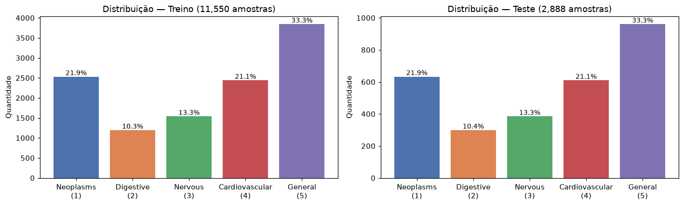
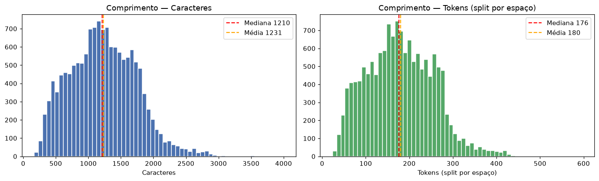
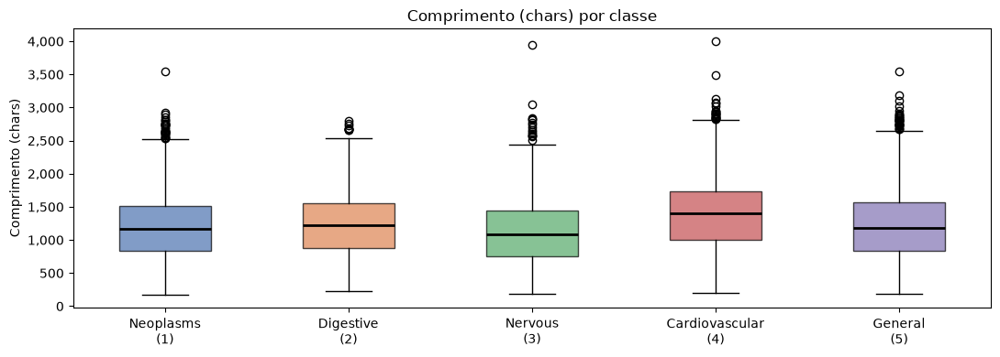
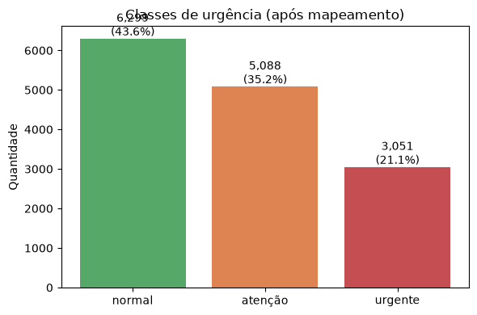

# EDA — Resumo dos Achados

**Dataset:** Medical Abstracts TC Corpus  
**Notebook:** [`notebooks/01_eda.ipynb`](../notebooks/01_eda.ipynb)  
**Data:** 2026-09-08

---

## 1. Visão Geral do Dataset

| Atributo | Valor |
|---|---|
| Total de amostras | **14.438** |
| Split treino | 11.550 (80,0%) |
| Split teste | 2.888 (20,0%) |
| Colunas | `condition_label` (int 1–5), `medical_abstract` (texto) |
| Valores nulos | **0** em ambas as colunas |
| Textos duplicados | **3.211** (22,2% do total) |
| Linhas completamente duplicadas | **0** |

Os 3.211 textos duplicados são cópias exatas dentro da mesma classe (sem ambiguidade de rótulo). São mantidos no treino — o modelo aprende a distribuição real do corpus.

---

## 2. Distribuição de Classes

### Split de treino (11.550 amostras)

| Label | Condição | Qtd | % |
|---|---|---:|---:|
| 1 | neoplasms | 2.530 | 21,9% |
| 2 | digestive system diseases | 1.195 | 10,3% |
| 3 | nervous system diseases | 1.540 | 13,3% |
| 4 | cardiovascular diseases | 2.441 | 21,1% |
| 5 | general pathological conditions | 3.844 | 33,3% |

### Split de teste (2.888 amostras)

| Label | Condição | Qtd | % |
|---|---|---:|---:|
| 1 | neoplasms | 633 | 21,9% |
| 2 | digestive system diseases | 299 | 10,4% |
| 3 | nervous system diseases | 385 | 13,3% |
| 4 | cardiovascular diseases | 610 | 21,1% |
| 5 | general pathological conditions | 961 | 33,3% |

**Observações:**
- Dataset **desbalanceado**: classe 5 (general) representa 33,3% das amostras, enquanto classe 2 (digestive) representa apenas 10,3% — razão de ~3,2×.
- A proporção treino/teste é idêntica por classe, confirmando **split estratificado**.
- O desbalanceamento justifica o uso de `class_weight='balanced'` no treinamento.

---

## 3. Estatísticas de Comprimento de Texto

### Comprimento em caracteres

| Estatística | Valor |
|---|---:|
| Média | 1.231 |
| Mediana (p50) | 1.210 |
| Desvio padrão | 507 |
| Mínimo | 170 |
| p25 | 850 |
| p75 | 1.589 |
| p90 | 1.858 |
| p95 | 2.050 |
| p99 | 2.594 |
| Máximo | 3.999 |

### Comprimento em tokens (split por espaço)

| Estatística | Valor |
|---|---:|
| Média | 180 |
| Mediana (p50) | 176 |
| Desvio padrão | 76 |
| Mínimo | 24 |
| p25 | 122 |
| p75 | 235 |
| p90 | 275 |
| p95 | 302 |
| p99 | 383 |
| Máximo | 596 |

### Por classe (chars) — mediana | média | p95

| Label | Condição | Mediana | Média | p95 |
|---|---|---:|---:|---:|
| 1 | neoplasms | 1.167 | 1.192 | 2.039 |
| 2 | digestive system diseases | 1.230 | 1.230 | 1.981 |
| 3 | nervous system diseases | 1.081 | 1.118 | 1.885 |
| 4 | cardiovascular diseases | 1.402 | 1.368 | 2.200 |
| 5 | general pathological conditions | 1.187 | 1.214 | 2.055 |

**Observações:**
- Textos de doenças cardiovasculares (label 4) tendem a ser mais longos (mediana 1.402 chars).
- Doenças do sistema nervoso (label 3) são os textos mais curtos (mediana 1.081 chars).
- **Nenhum texto** está fora do intervalo aceitável pela API (0 textos < 100 chars, 0 textos > 5.000 chars).

---

## 4. Mapeamento das Classes Originais → Urgência

A API retorna uma das 3 classes de urgência: `normal`, `atenção` ou `urgente`.
O mapeamento é baseado no **nível de risco clínico típico** de cada condição:

| Label | Condição Original | Urgência | Justificativa |
|---|---|---|---|
| 1 | neoplasms | `atenção` | Cânceres exigem acompanhamento prioritário mas raramente configuram emergência imediata sem sintomas agudos |
| 2 | digestive system diseases | `normal` | Patologias digestivas são majoritariamente crônicas e gerenciáveis em consulta ambulatorial |
| 3 | nervous system diseases | `atenção` | Doenças neurológicas requerem monitoramento próximo; podem evoluir rapidamente para quadros graves |
| 4 | cardiovascular diseases | `urgente` | Condições cardiovasculares têm alto risco de eventos agudos fatais (infarto, AVC) — triagem imediata |
| 5 | general pathological conditions | `normal` | Condições patológicas gerais são heterogêneas e majoritariamente crônicas sem emergência imediata |

### Distribuição resultante após o mapeamento

| Urgência | Qtd | % |
|---|---:|---:|
| `normal` | 6.299 | 43,6% |
| `atenção` | 5.088 | 35,2% |
| `urgente` | 3.051 | 21,1% |

**Nota:** o mapeamento reduz o desbalanceamento relativo (de 3,2× entre 5 classes para 2,1× entre 3 classes), facilitando o aprendizado do classificador.

---

## 5. Conclusões e Implicações para o Modelo

| Conclusão | Ação adotada |
|---|---|
| Dataset desbalanceado (razão ~3,2×) | `class_weight='balanced'` no `LogisticRegression` |
| Textos com comprimento variável (170–3.999 chars) | `TfidfVectorizer` com `sublinear_tf=True` mitiga dominância de textos longos |
| Nenhum texto fora do limite da API (5.000 chars) | Nenhum filtro de tamanho necessário no pré-processamento |
| 22% de textos duplicados (mesma classe) | Mantidos no treino; split estratificado evita vazamento treino/teste |
| Textos em inglês com vocabulário médico técnico | `ngram_range=(1,2)` captura termos compostos relevantes |
| Split treino/teste já estratificado | `train_test_split(stratify=y)` mantém a proporção em validações internas |
